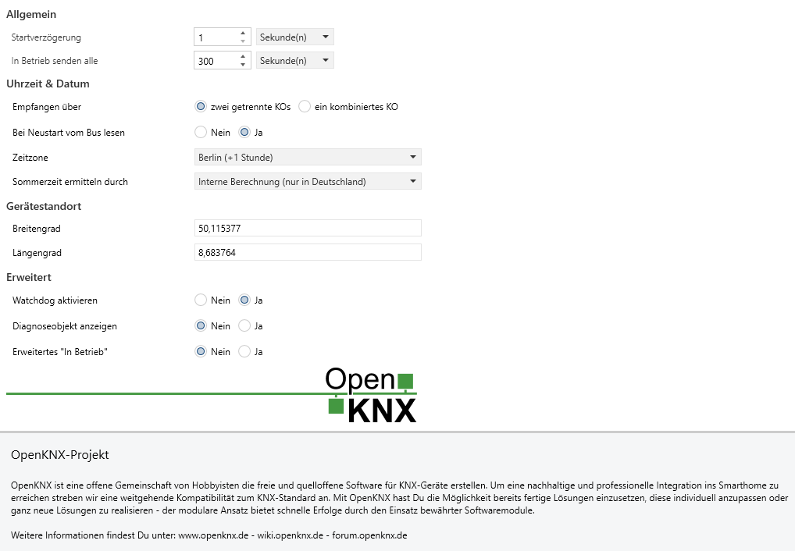

# Applikationsbeschreibung "Allgemeine Parameter"

Hier werden die Geräteübergreifenden Parameter und Kommunikationsobjekte beschrieben, die man in fast allen OpenKNX Geräten findet. 

## Inhalte
* [Allgemein](#allgemein)
  * [Startverzögerung](#startverzögerung)
  * [In Betrieb senden alle](#in-betrieb-senden-alle)
* [Uhrzeit & Datum](#uhrzeit--datum)
  * [Empfangen über](#empfangen-über)
  * [Bei Neustart vom Bus lesen](#bei-neustart-vom-bus-lesen)
  * [Zeitzone](#zeitzone)
  * [Sommerzeit ermitteln durch](#sommerzeit-ermitteln-durch)
* [Gerätestandort](#gerätestandort)
  * [Breitengrad](#breitengrad)
  * [Längengrad](#längengrad)
* [Erweitert](#erweitert)
  * [Watchdog aktivieren](#watchdog-aktivieren)
  * [Diagnoseobjekt anzeigen](#diagnoseobjekt-anzeigen)

## **Allgemein**

<kbd></kbd>

Hier werden Einstellungen getroffen, die die generelle Arbeitsweise des Gerätes bestimmen.

Die Seite "Allgemein" wird bei fast allen OpenKNX-Applikationen verwendet. Sie dient dazu, Einstellungen vorzunehmen, die bei allen OpenKNX-Geräten gleichermaßen benötigt werden.

<!-- DOC -->
### **Startverzögerung**

Hier kann man festlegen, wie viel Zeit vergehen soll, bis das Gerät nach einem Neustart seine Funktion aufnimmt. Dabei ist es egal, ob der Neustart durch einen Busspannungsausfall, einen Reset über den Bus, durch ein Drücken der Reset-Taste oder durch den Watchdog ausgelöst wurde.

Da das Gerät prinzipiell (sofern parametriert) auch Lesetelegramme auf den Bus senden kann, kann mit dieser Einstellung verhindert werden, dass bei einem Busneustart von vielen Geräten viele Lesetelegramme auf einmal gesendet werden und so der Bus überlastet wird.

**Anmerkung:** Auch wenn man hier technisch bis zu 16.000 Stunden Verzögerung angeben kann, sind nur Einstellungen im Sekundenbereich sinnvoll.

<!-- DOC -->
### **In Betrieb senden alle**

Das Gerät kann einen Status "Ich bin noch in Betrieb" über das KO 1 senden. Hier wird das Sendeintervall eingestellt.

Sollte hier eine 0 angegeben werden, wird kein "In Betrieb"-Signal gesendet und das KO 1 steht nicht zur Verfügung.

## **Uhrzeit & Datum**

Die Einstellungen für Uhrzeit, Datum und zeitabhängige Berechnungen werden hier vorgenommen. 

<!-- DOC -->
### **Empfangen über**

Dieses Gerät kann Uhrzeit und Datum vom Bus empfangen. Dabei kann man wählen, ob man Uhrzeit über ein Kommunikationsobjekt und das Datum über ein anders empfangen will oder beides, Uhrzeit und Datum, über ein kombiniertes Kommunikationsobjekt.

#### **Zwei getrennte KOs**

Wählt man diesen Punkt, wird je ein Kommunikationsobjekt für Uhrzeit (DPT 10) und Datum (DPT 11) bereitgestellt. Der KNX-Zeitgeber im System muss die Uhrzeit und das Datum für die beiden Kommunikationsobjekte liefern können.

#### **Ein kombiniertes KO**

Wählt man diesen Punkt, wird ein kombiniertes Kommunikationsobjekt für Uhrzeit/Datum (DPT 19) bereitgestellt. Der KNX-Zeitgeber im System muss die kombinierte Uhrzeit/Datum entsprechend liefern können.

<!-- DOC -->
### **Bei Neustart vom Bus lesen**

Nach einem Neustart können Uhrzeit und Datum auch aktiv über Lesetelegramme abgefragt werden. Mit diesem Parameter wird bestimmt, ob Uhrzeit und Datum nach einem Neustart aktiv gelesen werden.

Wenn dieser Parameter gesetzt ist, wird die Uhrzeit und das Datum alle 20-30 Sekunden über ein Lesetelegramm vom Bus gelesen, bis eine entsprechende Antwort kommt. Falls keine Uhr im KNX-System vorhanden ist oder die Uhr nicht auf Leseanfragen antworten kann, sollte dieser Parameter auf "Nein" gesetzt werden.

<!-- DOC -->
### **Zeitzone**

Für die korrekte Berechnung der Zeit wird die Zeitzone des Standortes benötigt.

<!-- DOC -->
### **Sommerzeit ermitteln durch**

Hier kann man eine der verfügbaren Möglichkeiten auswählen, mit der das Gerät ermitteln kann, ob gerade die Sommerzeit aktiv ist.

#### **Kommunikationsobjekt 'Sommerzeit aktiv'**

Wird diese Option ausgewählt, muss über das Kommunikationsobjekt 'Sommerzeit aktiv' dem Gerät mitgeteilt werden, ob gerade die Sommerzeit aktiv ist.

#### **Kombiniertem Datum/Zeit-KO (DPT 19)**

Erscheint nur, wenn der Datum- bzw. Zeitempfang über ein kombiniertes Datum/Zeit-KO (DPT 19) gewählt worden ist.

Wenn der Datum- bzw. Zeitempfang über ein kombiniertes Datum/Zeit-KO (DPT 19) gewählt worden ist, kann dieses Zeittelegramm auch die Information enthalten, ob gerade die Sommerzeit aktiv ist. Wenn der Zeitgeber im System diese Information mit dem DPT 19-Telegramm mitschicken kann, sollte diese Option gewählt werden.

#### **Interne Berechnung (nur für Deutschland)**

Erscheint nur, wenn die Zeitzone 'Berlin' gewählt worden ist.

Diese Option kann nur für Deutschland genutzt werden. Sie ist nicht zu verwenden, falls man in der selben Zeitzone wie Deutschland ist, aber in einem anderen Land.

## **Gerätestandort**

Für die korrekte Berechnung der Zeit für Sonnenauf- und -untergang werden die genauen Koordinaten des Standorts benötigt sowie auch die Zeitzone und die Information, ob gerade die Sommerzeit aktiv ist.

Die Geo-Koordinaten können bei Google Maps nachgeschaut werden, indem man mit der rechten Maustaste auf das Objekt klickt und die unten erscheinenden Koordinaten benutzt.

Die Standard-Koordinaten stehen für Frankfurt am Main, Innenstadt.

<!-- DOC -->
### **Breitengrad**

In dem Feld wird der Breitengrad des Standortes eingegeben.

<!-- DOC -->
### **Längengrad**

In dem Feld wird der Längengrad des Standortes eingegeben.

## Erweitert

Im folgenden können Einstellungen vorgenommen werden, die eher für erfahrene Benutzer sind.

<!-- DOC -->
### **Watchdog aktivieren**

Trotz hohen Qualitätsansprüchen, vielfältigen Tests und langem produktiven Einsatz kann man nie ausschließen, dass noch Fehler in der Firmware enthalten sind. Besonders ärgerlich sind Fehler, die ein Hardwaremodul zum hängen bringen und so die Funktion eingestellt wird.

Das Gerät bringt einen Watchdog mit, welcher es erlaubt, in Situationen, die einem "Hänger" entsprechen, die Hardware automatisch neu zu starten.

Der Vorteil eines Watchdog ist, dass er vor allem sporadische und selten vorkommende "Hänger" beseitigt, meist ohne dass man es merkt.

Der Nachteil ist, dass damit Fehler/Probleme verschleiert und umgangen werden, die besser an die Entwickler gemeldet und von ihnen gelöst werden sollten.

Mit einem 'Ja' wird der Watchdog eingeschaltet.

<!-- DOC -->
### **Diagnoseobjekt anzeigen**

Man kann bei diesem Gerät ein Diagnoseobjekt (KO 7) einschalten. Dieses Diagnoseobjekt ist primär zum Debuggen vorhanden, kann aber auch einem User bei einigen Fragen weiter helfen.

Die Grundidee vom Diagnoseobjekt: Man sendet mit der ETS Kommandos an das KO 7 und bekommt eine entsprechende Antwort. Derzeit sind nur wenige Kommandos für die Nutzung durch den Enduser geeignet, allerdings werden im Laufe der Zeit immer weitere Kommandos hinzukommen. Die Kommandos sind von den verwendeten OpenKNX-Modulen abhängig und werden in den dortigen Applikationsbeschreibungen beschrieben.

Mit einem 'Ja' wird das KO 7 'Diagnoseobjekt' freigeschaltet.

### **Erweitertes "In Betrieb"**

Der erweiterte "In Betrieb"-Modus liefert zusätzliche Informationen zum Gerätestatus. Dabei wir der Status nicht mehr als Boolesch (DPT-1) gesendet, sondern als Zahl (DPT-5). Mittels Bitmaske können so verschiedene Informationen ausgewertet werden.

* Das 8. Bit repräsentiert das normale Signal "In Betrieb" (immer aktiv).
* Das 7. Bit repräsentiert den Startvorgang und wird einmalig nach Ablauf der Startverzögerung übermittelt.
* Das 6. Bit repräsentiert, ob das Gerät durch einen Watchdog neu gestartet wurde und wird nur in Verbindung mit dem Startup-Bit einmalig gesendet.

Daraus ergeben sich aktuell 3 Werte ohne die Bits auswerten zu müssen.

* 1 = Normales "In Betrieb"
* 3 oder 7 = Das Gerät ist gerade hochgefahren
* 7 = Es gab einen Neustart, verursacht durch den Watchdog

**Tipp:** Bei Bedarf kann das Logikmodul daraus einzelne 1-Bit KOs machen.

**Hinweis:** Wenn eine neue Firmware auf das Gerät übertragen wird, kommt es in manchen Fällen dazu, dass das Flag für den "Neustart durch den Watchdog" gesetzt wurde.
