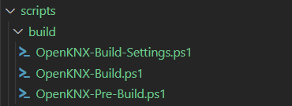
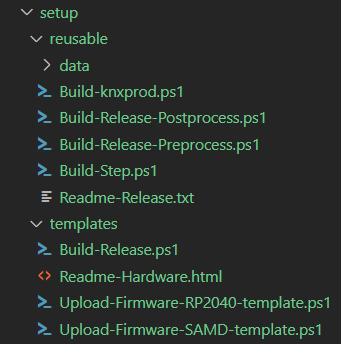
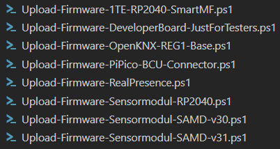

# **Build- und Release-Umgebung**

Um das Bauen und Ausliefern von OpenKNX-Firmware zu erleichtern, existieren verschiedene Skripts, die den Bauprozess unterstützen und das Bauen einer auslieferbaren Setup-Datei erlauben.

Im folgenden werden diese Skripts und der Auslieferprozess erläutert.

## **OpenKNX-Module**

In OpenKNX wird eine Wiederverwendung von Modulen ermöglicht. Damit das sowohl für Programmteile wie auch für die zugehörigen ETS-Applikationsteile funktioniert, wird eine gleichartige Verzeichnisstruktur und bei einigen Dateien eine Namenskonvention vorausgesetzt. 

Grundsätzlich können sowohl Verzeichnisstruktur als auch Namenskonvention ignoriert werden, nur hat man dann höheren Konfigurationsaufwand, um eine OpenKNX-Kompatible Build- und Release-Umgebung zu realisieren.

Wenn man sich an die Verzeichnisstruktur und Namenskonventionen hält, hat das nicht nur den Vorteil, dass man mit den vorhandenen Skripts fast alles geschenkt bekommt, es hat auch noch den Vorteil, dass andere Projektmitglieder durch den Wiedererkennungswert es leichter haben, ein solches Projekt zu verstehen und anzupassen (falls nötig).

### **Verzeichnisstruktur**

Die OpenKNX-Projektstruktur entspricht der klassischen PlatformIO-Projektstruktur. 

Im Folgenden wird nur auf die Besonderheiten von OpenKNX eingegangen.

#### **doc-Verzeichnis**

Hier wird die Dokumentation zum Projekt abgelegt (z.B. die Applikationsbeschreibung), als Markdown (.md). Der Vorteil ist, dass man sich diese Dokumentation dann direkt auf github ansehen kann.

#### **lib-Verzeichnis**

In diesem Verzeichnis stehen alle Module, die dieses Projekt verwendet. Diese abhängigen Module werden mit
    
    git subtree

eingebunden. Erfahrene Benutzer können auch mit Symlinks arbeiten. 

> Wichtig: Es werden keine statischen Libraries hierhin kopiert. Diese werden mittels der Datei platformio.ini ins Projekt eingebunden.

#### **scripts-Verzeichnis**

Hier stehen die zum Bauen und Veröffentlichen notwendigen Skripts. Diese werden weiter unten in der Anleitung im Detail beschrieben.

#### **.clang-format-Datei**

Diese Datei ist für die Formatierung der Quelltexte im Projekt verantwortlich. Sie ist aus dem knx-Repository entnommen und sorgt dafür, dass es keine git-diffs gibt, die nur aufgrund von unterschiedlichen Formatierungen von Quelltexten Auftreten.

### **Datei-Namenskonvention**

Die hier beschriebenen Namenskonventionen betreffen die Dateinamen im src-Verzeichnis. Ein OpenKNX-Modul repräsentiert einen Teil einer ETS-Applikation mitsamt des zugehörigen Codings in der Firmware. 
Während es für klassisches Coding genügend Gliederungskonzepte (Namespaces, Klassen, Methoden, usw.) gibt, unterstützt die ETS hier gar nichts! Es wird genau ein xml-File erwartet, dass in eine knxprod umgewandelt und von der ETS konsumiert wird. Um trotzdem eine gewisse Gliederung zu erreichen, wurde das Werkzeug "OpenKNXproducer" entwickelt, dass aus mehreren xml-Dateien nach gewissen Regeln eine ETS-konforme xml-Datei zusammenstellt. Im folgenden werden die Dateien und ihre Rolle beschrieben (nicht der Inhalt, das würde jede Dokumentation sprengen).

Im folgenden wird als Name des Moduls "*Modulname*" angenommen, der Name kann beliebig sein, solange er in unterschiedlichen Dateien immer gleich auftaucht.

#### ***Modulname*.cpp**

Es gibt immer eine Klasse, die als Startpunkt für das Modul genutzt wird, falls das Modul auch "standalone" lauffähig ist. Die Datei, die diese Klassen enthält, heißt ***Modulname*.cpp.**
Das ist vergleichbar mit dem Klassischen main.cpp bei klassischen Programmen. 

In OpenKNX gibt es auch immer ein main.cpp, dass *Modulname*.cpp benutzt.

#### ***Modulname*.xml**

Falls das Modul "standalone" genutzt werden kann, muss es auch in der ETS eine passende Startseite für dieses Modul geben, die eventuelle globale oder hardwarebezogene Einstellungen erlaubt. Ferner beinhaltet diese Datei alle Links zu weiteren xml-Dateien und Untermodulen.

Diese Datei heißt ***Modulname*.xml**.

#### ***Modulname*Share.cpp**

Module bestehen aus einem oder mehreren Kanälen, die eine (statische) Rumpf-Klasse benötigen, in der die Kanalübergreifenden Implementierungen stattfinden können. Diese Klasse instantiiert normalerweise alle Kanäle und macht übliche Aufgaben wie Event-Dispatching. Diese Klasse würde von anderen Modulen instantiiert werden, sobald das vorliegende Modul wiederverwendet werden soll.

Der Vorgeschlagene Name für diese Datei ist ***Modulname*Share.cpp**. Dabei ist das nur ein Namensvorschlag, keine Notwendigkeit für das Build-System.

#### ***Modulname*.share.xml**

Ebenso wie es für die Implementierung aller Kanalübergreifenden Teile eine Klasse geben muss, gibt es für die ETS auch einen kanalübergreifenden Teil, der die Definition nur einmalig vorkommender Parameter dieses Moduls erlaubt. Ferner kommen da auch alle Typdefinitionen aller Kanäle rein, da Typen nur einmal definiert werden dürfen.

#### ***Modulname*Channel.cpp**

Die eigentliche Kanaldefinition wird in einer eigenenKlasse implementiert. Von dieser Klasse werden so viele Instanzen erzeugt, wie es Kanäle in der ETS-Applikation gibt. 

Der Vorgeschlagene Name für diese Datei ist ***Modulname*Channel.cpp**. Dabei ist das nur ein Namensvorschlag, keine Notwendigkeit für das Build-System.

#### ***Modulname*.templ.xml**

Wie ein einzelner Kanal des Moduls in der ETS aussieht, wird in der Datei ***Modulname*.templ.xml** definiert. Der Inhalt dieser Datei wird vom *OpenKNXproducer* so oft vervielfacht, wie es Kanäle in der Applikation gibt.

#### ***Modulname*.h**

Aus den obigen xml-Files wird vom *OpenKNXproducer* eine ***Modulname*.knxprod**-Datei generiert, die in die ETS importiert werden kann, und eine ***Modulname*.h**-Datei, die die Adressen aller ETS-Parameter und -Kommunikationsobjekte enthält, die für eine Auswertung in der Firmware nötig sind.

Da es nur eine knxprod-Datei für die ETS gibt, gibt es auch nur eine h-Datei für die Firmware. Diese Datei enthält somit die Adressen für **alle** Parameter und KO, auch für die, die von anderen Modulen genutzt werden. Somit müssen alle Module - auch alle verwendeten - mit dieser .h-Datei compiliert werden. 

Da man nicht bei jedem Compiliervorgang die Projekte der verwendeten Module ändern möchte (z.B. durch kopieren der .h-Datei oder durch Ändern von #include-Anweisungen), wird folgender Weg beschritten:

- Die Datei ***Modulname*.h** wird als Datei knxprod.h in das Verzeichnis

    lib/OAM-Common/include/

kopiert. Das Verzeichnis liegt in Include-Pfad aller Projekte. Alle Projekte arbeiten nur mit

    #include "knxprod.h"

Das Verzeichnis ist auch im .gitignore von OAM-Common Repository, so dass der Kopiervorgang keine Projektänderung erfolgt. 

Die obigen Schritte erfolgen automatisiert vom Build-Script und werden weiter unten im eigenen Kapitel beschrieben.

> Die Konsequenz ist, dass es in keinem OpenKNX-Projekt die Datei knxprod.h geben darf.

#### ***Modulname*Hardware.h**

Jedes Projekt benötigt Hardwareinformationen, die angeben, auf welcher Hardware dieses Projekt funktioniert. In der Datei ***Modulname*Hardware.h** stecken #define-Anweisungen mit Pin-Definitionen, Compilealternativen und weiteren Hardwarespezifika. 

Da man nicht ausschließen kann, dass verwendete Module auch Hardwareinformationen benötigen, die zu dem gerade bearbeiteten Modul passen, muss die Datei ***Modulname*Hardware.h** auch diesen Modulen zur Verfügung gestellt werden.

Das Verfahren ist angelehnt zum knxprod.h:

- Die Datei ***Modulname*Hardware.h** wird als Datei hardware.h in das Verzeichnis

    lib/OAM-Common/include/

kopiert. Das Verzeichnis liegt in Include-Pfad aller Projekte. Alle Projekte arbeiten nur mit

    #include "hardware.h"

Das Verzeichnis ist auch im .gitignore von OAM-Common Repository, so dass der Kopiervorgang keine Projektänderung erfolgt. 

Die obigen Schritte erfolgen automatisiert vom Build-Script und werden weiter unten im eigenen Kapitel beschrieben.

> Die Konsequenz ist, dass es in keinem OpenKNX-Projekt die Datei hardware.h geben darf.

## **Build-Skripte**

Um einen "Build auf Knopfdruck" - wie von PlatformIO unterstützt - auch in OpenKNX zu ermöglichen, wird ein Build-Skript vor dem eigentlichen PIO-Buildvorgang ausgeführt. Die build-Skripte findet man in 

    lib/OGM-Common/scripts/build/

Es gibt das Hauptskript *OpenKNX-Build.ps1*. Dieses ruft *OpenKNX-Pre-Build.ps1* auf, das OpenKNX-Relevante Schritte vor dem Build aufruft. Anschließend wird der PIO-Build aufgerufen. Optional kann es noch ein *OpenKNX-Post-Build.ps1* geben, das notwendige Nacharbeiten macht. Derzeit gibt es noch kein generisches Post-Script, da es keine Nacharbeiten gibt.

Alle Skripte werden relativ zum aktuellen Projektverzeichnis adressiert, aus dem der Build angestoßen wurde. So ist es möglich, jeden der einzelnen Build-Steps durch eigene Skripte im scripts-Verzeichnis zu überschreiben und anzupassen.

Eine Sonderrolle spielt das Skript *OpenKNX-Build-Settings.ps1. Das enthält ein paar Standard-Definitionen für Dateinamen und Verzeichnisse, wie im Kapitel [Datei-Namenskonvention](#datei-namenskonvention) beschrieben.

Hat man sich an die Datei-Namenskonventionen gehalten, muss man hier nichts machen. Hat man andere Dateinamen verwendet, ist dieses Script die Möglichkeit, den Build- und Auslieferungsprozess trotzdem zu nutzen, indem man dort die Namen anpasst.

Wie sieht der Build-Prozess im detail aus:

1. PIO ruft 
   
       scripts/OpenKNX-Build.ps1

   im projekteigenem scripts-Verzeichnis auf. Theoretisch kann hier jetzt komplett der gesamte Build geskriptet sein und man ist fertig.
2. Im Normalfall ruft das Startskript 

       lib/OGM-Common/scripts/build/OpenKNX-Build.ps1 $args[0] $args[1]

    auf. Hier wird geprüft, ob es ein lokales Pre-Build-Skript gibt

        scripts/OpenKNX-Pre-Build.ps1
    
    wenn nicht, wird das ausgelieferte genommen

        lib/OGM-Common/scripts/build/OpenKNX-Pre-Build.ps1

3. Im Pre-Build-Script wird mit 

        scripts/OpenKNX-Build-Settings.ps1

    die Settings-Struktur initialisiert. Die sollte es geben. Will man das nicht selber schreiben sondern die Standard-Namenskonvention verwenden, ruft man in *scripts/OpenKNX-Build-Settings.ps1* einfach 

       $settings = lib/OGM-Common/scripts/build/OpenKNX-Build-Settings.ps1 $args[0] "Modulname" "MyPublicModule"
       
       Return $settings

    Hier werden die $settings so gesetzt, dass sie den Standard-Namenskonventionen entsprechen. Zwischen der ersten und der letzten Zeile können auch noch $settings-Werte geändert werden, falls sie den Standard-Namenskonventionen nicht entsprechen.

4. Durch $settings weiß der Build-Pre-Step nun, wie die zu kopierenden knxprod.h- und hardware.h-Files heißen (*Modulname*.h und *Modulname*Hardware.h). Diese werden kopiert und es wird zum Script OpenKNX-Build.ps1 zurückgekehrt.

5. Jetzt wird der PIO-Build angestoßen und die Sourcen werden compiliert.

6. Falls es ein

       scripts/OpenKNX-Post-Build.ps1 

    gibt, wird das noch aufgerufen und ausgeführt.

Dann ist der Build beendet und man kann die Firmware normal auf das Gerät flashen und testen.

## **Release-Skripte**

Ein Vorteil der OpenKNX-Integration ist es auch, dass man ein Releasefähiges ***Modulname*-Release-*x*.*y*.*z*.zip**-File "auf Knopfdruck" bekommt, dass alle auslieferungsrelevanten Dateien und Setup-Scripts enthält, damit ein SAMD oder ein RP2040 ohne Probleme geflashed werden kann.

Hierzu müssen einige wenige Release-Scripte erzeugt werden.

Wichtig ist zu verstehen, dass der externe Produktname nicht dem Produktnamen entsprechen muss, der in den Dateinamen verwendet wird. Das bisherige Modul ***Modulname*** kann extern durchaus ***MyPublicModule*** heissen.

Da zu einem Release auch ein Build aller Hardwarevarianten gehört, werden die oben beschriebenen Buid-Skripte auch verwendet.

Die Release-Skripte findet man in 

    lib/OGM-Common/scripts/setup/

Folgende Skripte sind vorhanden:

Wir unterscheiden hier zwischen 2 Unterverzeichnissen:

* reusable
  
  Das enthält Dateien, die für den Releaseprozess und das zu bauende Setup notwendig sind und direkt genutzt werden können

* template

  Diese Dateien sollten ins eigene Projekt kopiert werden (ins scritps-Verzeichnis) und dort so angepasst werden, dass sie zum aktuellen Projekt passen.

### **reusable-Dateien**

Die meisten Skripte hier werden direkt für die Setup-Routinen verwendet, die beim Kunden laufen und die Firmware auf die Hardware spielen.

#### **data-Verzeichnis**

Alle Inhalte werden ins Setup kopiert und zum flashen der Prozessor-Firmware verwendet.

#### **Build-knxprod.ps1**

Dieses Skript wird ins Setup kopiert und dient zum Bauen der knxprod beim Kunden.

#### **Build-Release-Preprocess.ps1

Dieses Skript erzeugt alle notwendigen Verzeichnisse und kopiert alle notwendigen Dateien für das Setup.

#### **Build-Release-Postprocess.ps1

Dieses Skript macht alle Abschlussarbeiten nach einem Release-Build, räumt auf, erzeugt das Release-Zip mit passendem Namen und Versionsnummer und kopiert alles ins release-Verzeichnis.

#### **Build-Step.ps1**

Dieses Skript baut eine einzelne Release-Hardware-Version unter Berücksichtigung der Build-Skripte.

#### **Readme-Release.txt**

Dieses Textfile beschreibt, wie man ein OpenKNX-Release installiert und wird unverändert in das Setup kopiert.

### **template-Verzeichnis**

Alle Dateien müssen in das scripts-Verzeichnis im Projekt kopiert werden.

#### **Build-Release.ps1**

In dieser Datei werden alle zu bauenden Hardwareversionen aufgelistet. Beispiele sind in der Datei als Kommentar enthalten.

#### **Upload-Firmware-*xxxx***.ps1

Diese Dateien müssen mit "Upload-Firmware-" beginnen und werden ins setup kopiert. Dies sind die Skripte, die der User aufruft, um eine bestimmte Firmware zu flashen. Daher sollte das xxxx einen aussagekräftigen Namen beinhalten, zu welcher Hardware diese Firmware passt. 

Beispiele aus dem Logikmodul:

Für jede in der Datei Build-Firmware.ps1 aufgelistete (und somit gebaute) Hardware-Variante muss es eine Upload-Firmware-*xxxx*-Datei geben.

## **Einbindung der Skripte in PIO**

PIO nutzt Visual Studio Code (VSCode) als Entwicklungsumgebung. VSCode erlaubt es, Aufgaben (Tasks) zu definieren, die man auf Knopfdruck (Tasturkürzel) aufrufen kann. Mit Hilfe dieser Technik kann man Build- und Release-Skripte sehr bequem in PIO einbinden.

### **Tasks**

Zu Tasks findet man dezidierte Hilfe in der VSCode-Doku. Hier soll es nur darum gehen, exemplarisch einen Build- und einen Release-Aufruf zu dokumentieren.

Tasks werden in der Datei

    .vscode/tasks.json

definiert.

#### **Build-Task**

Ein Build-Task sieht so aus (zu erkennen an *group: "build"*):

    {
        "label": "Build RP2040",
        "type": "shell",
        "command": "scripts/OpenKNX-Build.ps1",
        "args": [
            "build_RP2040"
        ],
        "group": "build",
        "problemMatcher": []
    },

Anzupassen ist hier nur der Name (für den Benutzer die Info, was gebaut werden soll) und das "build-RP2040" in den **args**.

Das Argument (args) ist das Environment (env:build_RP2040) von PIO, das gebaut werden soll. Was die env: sind und wie sie definiert werden, ist in PIO beschrieben und Teil der Entwicklungsprozeses (und nicht Teil dieser Doku).

Obiges ist ein Build-Task, zum Bauen einer Hardware-Version gedacht.

#### **Test-Task**

Ein Test-Task ist - wie der Name schon sagt - zum Starten von Tests gedacht. In OpenKNX werden Test-Tasks auch zum Bauen der knxprod und von Releases genutzt. 

Natürlich können Test-Tasks zum Bauen von Tests genutzt werden, allerdings gibt es in OpenKNX (noch) keine Testumgebung mit standardisierten Tests. Natürlich können Tests auf Projektebene realisiert werden.

Ein Test-Task sieht so aus (zu erkennen an *group: "test"*):

    {
        "label": "Build-Release",
        "type": "shell",
        "command": "scripts/Build-Release.ps1",
        "args": [
            "Release"
        ],
        "problemMatcher": [],
        "group": "test"
    },

Anzupassen ist hier nur der Name für den Benutzer die Info, was gebaut werden soll). 

#### **Task zum Bauen der knxprod**

Um eine knxprod zu bauen, wird folgender Test-Task verwendet:

    {
        "label": "OpenKNXproducer",
        "type": "shell",
        "options": {
            "cwd": "${workspaceFolder}/src"
        },
        "command": "~/bin/OpenKNXproducer.exe",
        "args": [
            "create",
            "--Debug",
            "Modulname"
        ],
        "problemMatcher": [],
        "group": "test"
    },

Es muss nur *Modulname* angepasst werden (siehe [Namenskonventionen](#datei-namenskonvention)).

### Tastaturkürzel

Sobald Tasks eingerichtet sind, können diese in VSCode ausgeführt werden, indem man 

1. die Taste F1 drückt
2. gefolgt von "Run Build Task"
3. und dann aus der erscheinenden Liste den gewünschten Build-Taks auswählt.

Für Test-Tasks macht man das analog mit "Run Test Task".

Die ersten beiden Schritte kann man abkürzen, indem man ein Tastaturkürzel erzeugt, das den 