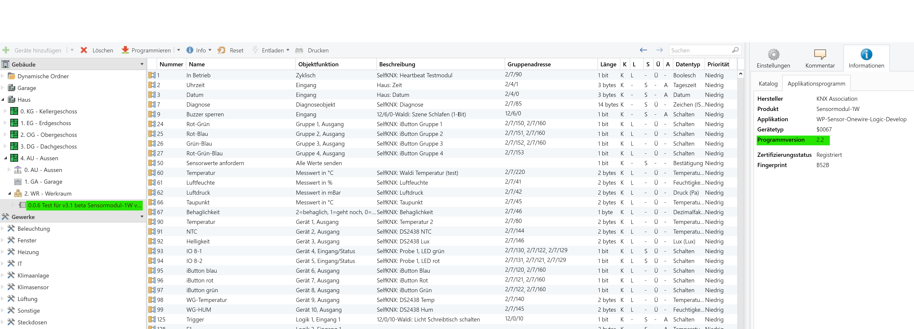
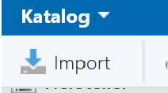
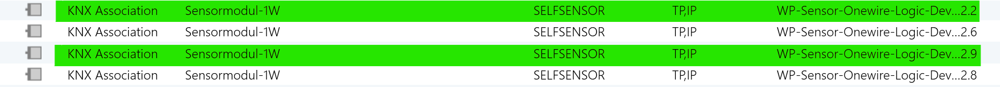
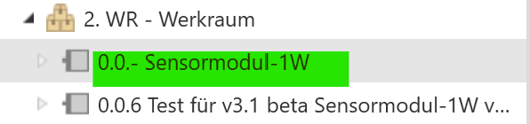
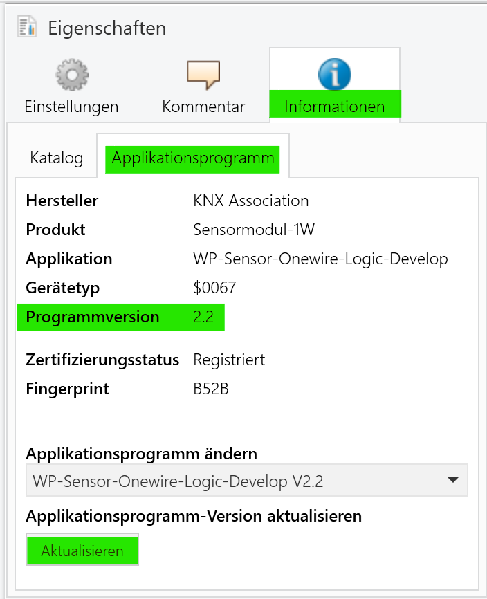
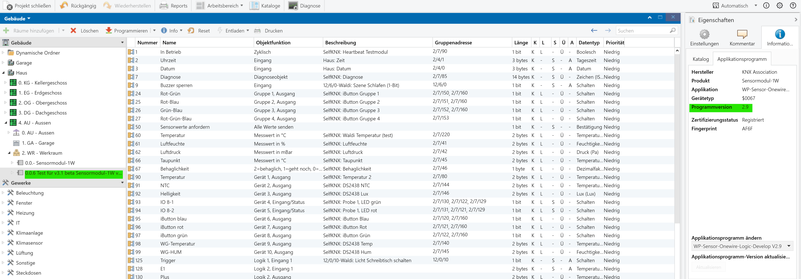

# Wie aktualisiert man eine ETS-Applikation auf eine aktuelle Version

Die ETS bietet eine Möglichkeit, alte Applikationsversionen auf eine aktuelle Version zu aktualisieren, ohne die KO-Zuordnungen und Parameter zu verlieren. Allerdings muss die Applikation dafür vorbereitet sein. 

OpenKNX-Applikationen sind prinzipiell für ein Update geeignet. Ausnahmen bzw. Einschränkungen werden in der jeweiligen Applikationsbeschreibung erwähnt und erklärt.

Vor allem bei Applikationen, die viele Parameter oder KO-GA-Zuweisungen haben, ist es eine wesentliche Komfortfunktion, für eine neue Version einfach ein Update durchzuführen, anstatt alle Parameter und KO-GA-Zuweisungen erneut eingeben zu müssen.

Die folgende Anleitung beschreibt exemplarisch, wie bei einem Update für eine Applikation vorzugehen ist. Diese Beschreibung nutzt zwar exemplarisch eine OpenKNX-Applikation, das Verfahren ist aber grundsätzlich für jede ETS-Applikation anwendbar. Einzeige Voraussetzung ist, dass der Hersteller der Applikation die Updatemöglichkeit der ETS unterstützt.

## Voraussetzungen

In dem ETS-Projekt existiert bereits eine Applikation für die man ein Update einspielen will:

Man erkennt, dass diese Applikation viele KO-GA-Zuweisungen hat und dass diese die Programmversion 2.2 hat.

**Vor einem Update sollte man immer das aktuelle Projekt exportieren, um notfalls auf eine Projektsicherung zurückgreifen zu können.**

## Neuere Applikation importieren

Als erstes muss eine neuere Applikation in den ETS-Katalog importiert werden. Das kann über den ETS-Katalog erfolgen oder - wie bei OpenKNX-Applikationen - über den Import-Button im ETS-Katalog.

Nach dem Import sollte man im Katalog die Applikation mit der alten Version sowie auch mit der neusten Version sehen.

## Neuere Applikation zum Projekt hinzufügen

Bisher ist die neue Applikation zwar in der ETS bekannt, da sie im Katalog steht, aber damit ist sie noch nicht dem ETS-Projekt bekannt, in dem das Update durchgeführt werden soll.

Als nächster Schritt muss die neuere Applikation dem Projekt hinzugefügt werden.

Die neue Applikation muss nicht im gleichen Raum oder dem gleichen Gebäude hinzugefügt werden, sie muss nur **irgendwo** im Projekt existieren (irgendwo in der Geräteliste enthalten sein). Sie muss auch nicht parametrisiert werden oder sonst etwas damit gemacht werden. Sie dient nur dazu da, dass das Projekt über die neue Version informiert ist. Anhand dieser Information kann die ETS eine Aktualisierung anbieten.

Jetzt muss man erneut die Eigenschaften der Applikation anschauen, die aktualisert werden soll:

Jetzt wird in der Applikation ein Update-Button angeboten. Das Update wird durch einen Klick auf diesen Button durchgeführt.

**Wichtig:** Nicht die Version über die darüberliegende Dropdown auswählen. In diesem Fall wird eine neue Version für das alte Gerät übernommen, allerdings werden **alle** Parameter und KO-GA-Zuweisungen gelöscht. Mittels der Dropdown wird das Gerät also initialisiert!

Hintergrund: Die Dropdown ist nicht für den Update gedacht, sondern für den Downgrade. Man kann über die Dropdown einfach auf eine frühere Version der Applikation zurückgehen, falls eine neue Applikation nicht so funktioniert, wie man das will. Allerdings gehen bei einem Downgrade immer alle Einstellungen verloren. Deswegen ist ein Downgrade immmer besser über ein Einspielen eines früheren Backups zu machen.

Wie man im Bild unten erkennt, war das Update erfolgreich. Die Programmverions ist jetzt 2.9, die KO-GA-Zuordnungen sind erhalten geblieben. Auch die Parameter sind alle erhalten geblieben, obhwohl nicht im Bild gezeigt.

Das vorher importierte Gerät mit der neuen Version (0.0.- Sensormodul-1W) kann nach dem Update wieder entfernt werden. Weitere Geräte im Projekt können einfach durch einen Klick auf den Update-Button aktualisiert werden.

## Update wird nicht angeboten

Falls man alle Schritte oben durchgeführt hat, aber trotzdem kein Update angeboten wird (der Update-Button ist ausgegraut), liegt das daran, dass für diese Applikation kein Update möglich ist.

Wie schon oben beschrieben, muss ein Update auch durch den Hersteller unterstützt werden. Denn nur der Hersteller weiß, ob eine Applikation kompatibel zu einer vorherigen ist. Der Hersteller muss der ETS dezidiert vorgeben, welcher Version einer ETS-Applikation mit welcher vorherigen Version kompatibel ist. Die ETS wertet diese Informationen aus und bietet den Update-Button nur für kompatible Versionen an.

## Update hat nicht geklappt

Falls der Update nicht geklappt hat, hat man folgende Möglichkeiten:

* Die ETS bietet ein Undo (oben in der Button-Leiste), diesen einfach betätigen.
* Den vorher erstellten Projektexport wieder importieren.

Anschließend in der Applikationsbeschreibung nachlesen, ob dort nicht weitere Bedingungen/Aktionen beschrieben sind, die vor einem Update vorgenommen werden sollten.

## Nach einem erfolgreichen Update

Bitte in der Applikationsbeschreibung nachlesen, ob noch Nacharbeiten nach einem Update erforderlich sind. Da ein Update normalerweise neben neuen Funktionen auch Fehlerbehebungen mit sich bringt, könnte es sein, dass bestimmte Parameter weitere Einstellungen erfordern oder statt einem früheren Parameter jetzt mehrere verfügbar sind, die eingestellt werden müssen.
